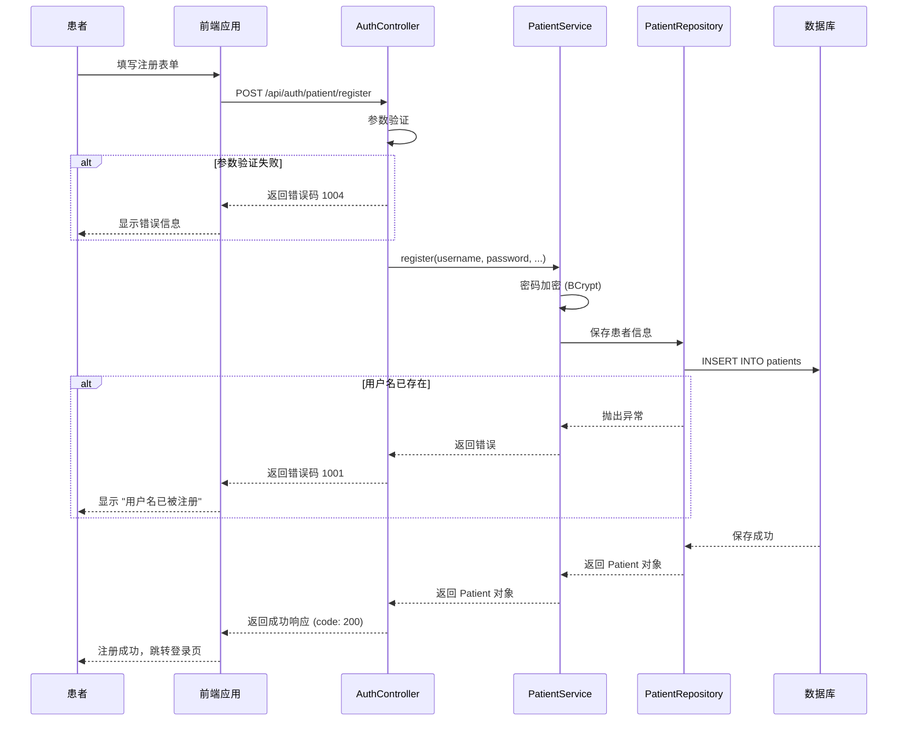
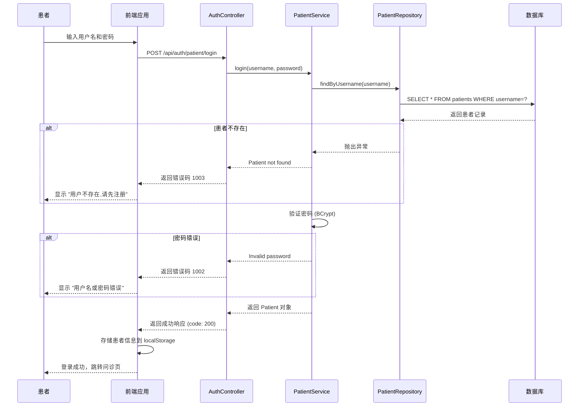
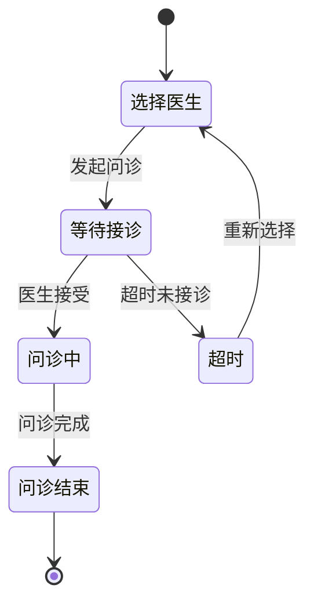

# 系统架构文档

## 概述
本文档描述在线问诊系统的整体架构设计、技术选型、设计决策和系统结构，为 AI 模型提供对系统架构的全面理解。

---

## 架构概览

### 高层架构图

```mermaid
graph TB
    subgraph "客户端层"
        WEB[Web 浏览器]
        MOBILE[移动端浏览器]
    end
    
    subgraph "前端层 (Frontend Layer)"
        VUE[Vue 3 应用]
        ROUTER[Vue Router]
        STORE[状态管理]
        API_CLIENT[API 客户端]
    end
    
    subgraph "后端层 (Backend Layer)"
        subgraph "微服务"
            USER_SVC[用户服务<br/>qa-service-user<br/>:8080]
            QUESTION_SVC[问诊服务<br/>qa-service-question<br/>:8081]
        end
        
        CORS[CORS 配置]
        SECURITY[安全层]
    end
    
    subgraph "数据层 (Data Layer)"
        H2[(H2 内存数据库<br/>开发环境)]
        MYSQL[(MySQL 8.0<br/>生产环境)]
        JPA[JPA/Hibernate<br/>ORM 框架]
    end
    
    subgraph "基础设施层 (Infrastructure Layer)"
        DOCKER[Docker]
        DOCKER_COMPOSE[Docker Compose]
        PHPMYADMIN[phpMyAdmin<br/>:8082]
    end
    
    subgraph "外部服务"
        AI_SERVICE[AI 问诊服务<br/>(预留)]
    end
    
    WEB --> VUE
    MOBILE --> VUE
    VUE --> API_CLIENT
    ROUTER --> VUE
    STORE --> VUE
    API_CLIENT --> CORS
    
    CORS --> USER_SVC
    CORS --> QUESTION_SVC
    
    USER_SVC --> JPA
    QUESTION_SVC --> JPA
    JPA --> H2
    JPA --> MYSQL
    
    DOCKER --> MYSQL
    DOCKER --> PHPMYADMIN
    DOCKER_COMPOSE --> DOCKER
    
    QUESTION_SVC --> AI_SERVICE
```

---

## 架构原则

### 1. 前后端分离 (Frontend-Backend Separation)
- **前端**: 负责用户界面和交互逻辑（Vue 3 + TypeScript）
- **后端**: 负责业务逻辑和数据持久化（Spring Boot）
- **通信**: 通过 REST API 进行数据交互（JSON 格式）

### 2. 微服务架构 (Microservices Architecture)
- **用户服务 (qa-service-user)**: 管理患者和医生的注册、登录、信息查询、预约管理、排班管理
- **问诊服务 (qa-service-question)**: 处理问诊核心功能（问答、记录等，待实现）
- **独立部署**: 每个服务可以独立开发、测试和部署
- **独立端口**: 用户服务 8080，问诊服务 8081

### 3. 预约流程架构
系统支持患者在线预约医生的功能，包含以下核心组件：
- **预约管理**: 创建、查询、取消、确认、完成预约
- **排班管理**: 医生设置可预约的时间段
- **状态流转**: PENDING → CONFIRMED → COMPLETED 或 PENDING → CANCELLED

### 3. 分层架构 (Layered Architecture)
```
┌─────────────────────────────────────┐
│  表示层 (Presentation Layer)        │  ← Controller
├─────────────────────────────────────┤
│  业务逻辑层 (Service Layer)          │  ← Service
├─────────────────────────────────────┤
│  数据访问层 (Data Access Layer)     │  ← Repository
├─────────────────────────────────────┤
│  实体层 (Entity Layer)               │  ← Entity
└─────────────────────────────────────┘
```

### 4. 响应式设计 (Responsive Design)
- 前端使用 Vue 3 的响应式系统
- 支持桌面端和移动端访问
- 医生端和患者端使用不同的界面

---

## 技术栈详情

### 前端技术栈

| 技术 | 版本 | 用途 |
|------|------|------|
| Vue | 3.5.13 | 前端框架 |
| TypeScript | 5.7.3 | 类型安全的 JavaScript |
| Vite | 6.2.4 | 构建工具和开发服务器 |
| Vue Router | 4.5.0 | 前端路由管理 |
| Axios | 1.8.1 | HTTP 客户端 |

### 后端技术栈

| 技术 | 版本 | 用途 |
|------|------|------|
| Spring Boot | 3.4.10 | 后端框架 |
| Spring Data JPA | - | 数据访问层 |
| Hibernate | - | ORM 框架 |
| H2 Database | - | 开发环境内存数据库 |
| MySQL Connector | 8.0.33 | MySQL JDBC 驱动 |

### 基础设施技术栈

| 技术 | 版本 | 用途 |
|------|------|------|
| Docker | - | 容器化平台 |
| Docker Compose | 3.8 | 多容器编排 |
| MySQL | 8.0 | 关系型数据库 |
| phpMyAdmin | latest | 数据库管理工具 |

---

## 组件详情

### 1. 前端应用 (Vue 3)

**用途**: 提供用户界面和交互体验

**职责**:
- 患者端：注册、登录、选择医生、在线问诊
- 医生端：登录、接诊、回复患者
- 路由管理：页面导航和权限控制
- 状态管理：用户会话管理

**核心模块**:
```
web/qa-web/src/
├── api/                    # API 客户端封装
│   ├── auth.ts             # 患者认证 API
│   └── doctor.ts           # 医生信息 API
├── views/                  # 页面组件
│   ├── Home.vue            # 首页
│   ├── PatientLogin.vue    # 患者登录
│   ├── PatientRegister.vue # 患者注册
│   ├── Doctors.vue         # 医生列表
│   ├── Consultation.vue    # 问诊页面
│   ├── DoctorLogin.vue     # 医生登录
│   └── DoctorRoom.vue      # 医生接诊室
├── router/
│   └── index.ts            # 路由配置
└── store/
    └── index.ts            # 状态管理
```

**技术实现**:
- **路由守卫**: 保护需要认证的页面（`requiresAuth: true`）
- **本地存储**: 使用 `localStorage` 存储当前登录患者信息
- **API 封装**: 统一的 API 调用接口，便于维护和错误处理

---

### 2. 用户服务 (qa-service-user)

**用途**: 管理患者和医生用户

**职责**:
- 患者注册和登录
- 医生信息查询
- 用户数据验证

**基础路径**: `/api`

**核心模块**:
```
server/qa-service-user/src/main/java/com/leansofx/qaserviceuser/
├── controller/
│   ├── AuthController.java     # 患者认证接口
│   ├── DoctorController.java   # 医生信息接口
│   └── TestController.java     # CORS 测试接口
├── service/
│   ├── PatientService.java     # 患者业务逻辑
│   └── DoctorService.java      # 医生业务逻辑
├── repository/
│   ├── PatientRepository.java  # 患者数据访问
│   └── DoctorRepository.java   # 医生数据访问
└── entity/
    ├── Patient.java             # 患者实体
    └── Doctor.java              # 医生实体
```

**API 端点**:
- `POST /api/auth/patient/register` - 患者注册
- `POST /api/auth/patient/login` - 患者登录
- `POST /api/auth/patient/logout` - 患者登出
- `GET /api/auth/patient/check-username` - 检查用户名
- `GET /api/auth/patient` - 获取所有患者
- `GET /api/auth/patient/{id}` - 根据 ID 获取患者
- `GET /api/doctors` - 获取所有医生
- `GET /api/doctors/active` - 获取活跃医生
- `GET /api/doctors/{username}` - 根据用户名获取医生

**技术实现**:
- **密码加密**: 使用 BCrypt 算法加密密码
- **CORS 配置**: 允许前端域名的跨域请求
- **数据验证**: 在 Controller 层进行参数验证

---

### 3. 问诊服务 (qa-service-question)

**用途**: 处理在线问诊核心功能

**状态**: 🚧 开发中

**计划功能**:
- 创建问诊会话
- 患者提问
- 医生回复
- 问诊记录查询
- AI 辅助问诊（预留）

**基础路径**: `/api/questions` (待实现)

---

### 4. 数据库层

#### 开发环境：H2 内存数据库

**配置**:
```properties
spring.datasource.url=jdbc:h2:mem:patientdb
spring.datasource.driverClassName=org.h2.Driver
spring.datasource.username=sa
spring.datasource.password=password
spring.jpa.database-platform=org.hibernate.dialect.H2Dialect
spring.h2.console.enabled=true
spring.h2.console.path=/h2-console
```

**优势**:
- 无需安装，开箱即用
- 内存模式，速度快
- 支持 H2 控制台，便于调试

#### 生产环境：MySQL 8.0

**配置**:
```properties
# 可通过 Docker Compose 启动
# 连接参数:
#   host: localhost
#   port: 3306
#   database: qa_interview
#   username: root
#   password: 123456
```

**初始化脚本**: `docker/init-db.sql`

**数据表**:
- `patients` - 患者信息表
- `doctors` - 医生信息表
- `questions` - 问诊记录表（预留）

---

## 数据流程

### 患者注册流程



### 患者登录流程



### 问诊流程（待实现）



---

## 设计模式

### 1. MVC 模式 (Model-View-Controller)

**后端实现**:
```java
// Model (Entity)
@Entity
public class Patient {
    @Id
    @GeneratedValue(strategy = GenerationType.IDENTITY)
    private Long id;
    private String username;
    // ...
}

// View (JSON Response)
{
  "code": 200,
  "data": { "id": 1, "username": "patient001" },
  "message": "success"
}

// Controller
@RestController
@RequestMapping("/api/auth/patient")
public class AuthController {
    @PostMapping("/login")
    public ResponseEntity<Map<String, Object>> login(@RequestBody LoginRequest request) {
        // ...
    }
}
```

### 2. 仓储模式 (Repository Pattern)

**后端实现**:
```java
public interface PatientRepository extends JpaRepository<Patient, Long> {
    Optional<Patient> findByUsername(String username);
    boolean existsByUsername(String username);
}

@Service
public class PatientService {
    @Autowired
    private PatientRepository patientRepository;
    
    public Patient register(String username, String password, ...) {
        // 业务逻辑
        return patientRepository.save(patient);
    }
}
```

### 3. 单例模式 (Singleton Pattern)

**前端实现**:
```typescript
// API 客户端单例
const API_BASE_URL = 'http://localhost:8080/api/auth/patient';

export const login = async (data: LoginRequest): Promise<ApiResponse<Patient>> => {
  const response = await axios.post<ApiResponse<Patient>>(`${API_BASE_URL}/login`, data);
  return response.data;
};
```

### 4. 观察者模式 (Observer Pattern) - 预留

**用途**: 当问诊状态变更时，通知相关方（患者、医生、AI 服务）

**计划实现**:
```java
// 事件发布
@Component
public class QuestionEventPublisher {
    @Autowired
    private ApplicationEventPublisher eventPublisher;
    
    public void publishQuestionCreated(Question question) {
        eventPublisher.publishEvent(new QuestionCreatedEvent(question));
    }
}

// 事件监听
@Component
public class NotificationEventListener {
    @EventListener
    public void handleQuestionCreated(QuestionCreatedEvent event) {
        // 发送通知
    }
}
```

---

## 安全架构

### 1. 认证机制

**当前实现**:
- 简单的用户名/密码认证
- 前端使用 `localStorage` 存储登录状态
- 后端无 JWT 令牌验证（简化设计）

**安全考虑**:
- ⚠️ 当前实现不适合生产环境
- 建议在生产环境中实现 JWT 或 Session 认证

**计划改进**:
```java
// JWT 认证（待实现）
@RestController
@RequestMapping("/api/auth")
public class JwtAuthController {
    @PostMapping("/login")
    public ResponseEntity<JwtResponse> login(@RequestBody LoginRequest request) {
        // 验证凭据
        // 生成 JWT 令牌
        // 返回令牌
    }
}
```

### 2. 密码安全

**当前实现**:
```java
// 密码加密
@PostMapping("/register")
public ResponseEntity<Map<String, Object>> register(@RequestBody RegisterRequest request) {
    // 使用 BCrypt 加密密码
    String encodedPassword = passwordEncoder.encode(request.getPassword());
    patient.setPassword(encodedPassword);
    // ...
}
```

**安全特性**:
- ✅ 使用 BCrypt 算法加密密码
- ✅ 密码不以明文存储
- ⚠️ 缺少密码强度验证（建议添加）

### 3. CORS 配置

**当前实现**:
```java
// qa-service-user
@CrossOrigin(origins = {"http://localhost:5173", "http://localhost:3000"})

// qa-service-question
@CrossOrigin(origins = "*", maxAge = 3600)
```

**安全考虑**:
- ⚠️ 生产环境应限制 `origins`，不使用 `*`
- 建议配置允许的前端域名白名单

### 4. 路由守卫（前端）

**当前实现**:
```typescript
// router/index.ts
router.beforeEach((to, _from, next) => {
  const requiresAuth = to.meta.requiresAuth;
  const currentPatient = localStorage.getItem('currentPatient');

  if (requiresAuth && !currentPatient) {
    // 需要登录但未登录，跳转到登录页
    next({ path: '/patient/login', query: { redirect: to.fullPath } });
  } else {
    next();
  }
});
```

**受保护路由**:
- `/consultation` - 问诊页面
- `/consultation/:doctorUsername` - 医生问诊室

---

## 性能考虑

### 1. 数据库优化

**当前实现**:
```properties
# H2 内存数据库（开发环境）
spring.datasource.url=jdbc:h2:mem:patientdb

# MySQL（生产环境）
# 建议在 production.properties 中配置连接池
```

**计划优化**:
```properties
# 连接池配置（HikariCP）
spring.datasource.hikari.maximum-pool-size=10
spring.datasource.hikari.minimum-idle=5
spring.datasource.hikari.connection-timeout=30000

# JPA 优化
spring.jpa.properties.hibernate.enable_lazy_load_no_trans=true
spring.jpa.properties.hibernate.batch_fetch_style=IN
```

### 2. 前端优化

**当前实现**:
- Vite 构建工具，支持热模块替换（HMR）
- TypeScript 类型检查，减少运行时错误

**计划优化**:
```typescript
// API 请求缓存（待实现）
const doctorCache = new Map<string, Doctor>();

export const getDoctorByUsername = async (username: string): Promise<Doctor> => {
  if (doctorCache.has(username)) {
    return doctorCache.get(username)!;
  }
  
  const response = await fetch(`${API_BASE_URL}/doctors/${username}`);
  const result = await response.json();
  
  doctorCache.set(username, result.data);
  return result.data;
};
```

### 3. 分页查询（待实现）

**计划实现**:
```java
@GetMapping
public ResponseEntity<Map<String, Object>> getAllPatients(
        @RequestParam(defaultValue = "0") int page,
        @RequestParam(defaultValue = "10") int size) {
    
    Pageable pageable = PageRequest.of(page, size);
    Page<Patient> patientPage = patientRepository.findAll(pageable);
    
    Map<String, Object> response = new HashMap<>();
    response.put("code", 200);
    response.put("data", patientPage.getContent());
    response.put("currentPage", patientPage.getNumber());
    response.put("totalItems", patientPage.getTotalElements());
    response.put("totalPages", patientPage.getTotalPages());
    
    return ResponseEntity.ok(response);
}
```

---

## 部署架构

### 当前部署方式

**开发环境**:
```bash
# 启动 Docker 容器（MySQL + phpMyAdmin）
docker-compose up -d

# 启动后端服务
cd server/qa-service-user && ./mvnw spring-boot:run
cd server/qa-service-question && ./mvnw spring-boot:run

# 启动前端应用
cd web/qa-web && npm install && npm run dev
```

### Docker Compose 配置

```yaml
# docker-compose.yml
version: '3.8'

services:
  mysql:
    image: mysql:8.0
    container_name: qa-mysql
    environment:
      MYSQL_ROOT_PASSWORD: 123456
      MYSQL_DATABASE: qa_interview
    ports:
      - "3306:3306"
    volumes:
      - mysql_data:/var/lib/mysql
      - ./docker/init-db.sql:/docker-entrypoint-initdb.d/init-db.sql

  phpmyadmin:
    image: phpmyadmin/phpmyadmin
    container_name: qa-phpmyadmin
    depends_on:
      - mysql
    ports:
      - "8082:80"
    environment:
      PMA_HOST: mysql
      PMA_ARBITRARY: 1

volumes:
  mysql_data:
```

### 生产环境部署（建议）

**架构**:
```
                ┌─────────────────┐
                │   Nginx (反向代理) │
                │  端口: 80/443    │
                └────────┬────────┘
                         │
         ┌───────────────┼───────────────┐
         │               │               │
    ┌────┴────┐    ┌────┴────┐    ┌────┴────┐
    │ 前端应用  │    │ 用户服务  │    │ 问诊服务  │
    │ (静态文件)│    │ :8080   │    │ :8081   │
    └─────────┘    └────┬────┘    └────┬────┘
                         │               │
                         └───────┬───────┘
                                 │
                         ┌───────┴───────┐
                         │   MySQL 8.0   │
                         │   (主从复制)    │
                         └───────────────┘
```

**部署步骤**（待实现）:
1. 构建前端应用: `npm run build`
2. 构建后端 JAR: `./mvnw clean package`
3. 配置 Nginx 反向代理
4. 使用 Docker Compose 部署所有服务
5. 配置 SSL/TLS 证书

---

## 可扩展性设计

### 1. 微服务扩展

**水平扩展**:
- 用户服务和问诊服务可以独立扩展
- 使用负载均衡器（如 Nginx）分发请求
- 无状态设计，便于添加服务实例

**数据分区**:
- 用户可以按需切换到 MySQL 生产数据库
- 支持数据库读写分离（待实现）
- 支持分库分表（待实现）

### 2. 功能扩展

**AI 问诊功能（预留）**:
```java
// 计划实现
@Service
public class AiConsultationService {
    @Autowired
    private AiClient aiClient;
    
    public String generateResponse(String question) {
        // 调用 AI 服务生成回复
        return aiClient.ask(question);
    }
}
```

**消息通知功能（预留）**:
```java
// 计划实现
@Service
public class NotificationService {
    public void sendNotification(String userId, String message) {
        // 发送邮件/短信/推送通知
    }
}
```

---

## 监控和可观测性（待实现）

### 1. 应用监控

**计划集成**:
- Spring Boot Actuator: 提供健康检查端点
- Micrometer: 指标收集
- Prometheus + Grafana: 指标可视化

**健康检查端点**:
```
GET /actuator/health       # 应用健康状态
GET /actuator/metrics      # 应用指标
GET /actuator/info         # 应用信息
```

### 2. 日志管理

**当前实现**:
- 使用 Spring Boot 默认的日志框架（Logback）
- 控制台输出日志

**计划改进**:
```properties
# 日志配置
logging.level.com.leansofx=DEBUG
logging.file.name=logs/qa-service-user.log
logging.pattern.console=%d{yyyy-MM-dd HH:mm:ss} - %msg%n
```

---

## 架构演进

### 版本规划

| 版本 | 日期 | 架构变更 |
|------|------|----------|
| **v1.0.0** | 2024-01-01 | 初始版本 |
| | | - 前后端分离架构 |
| | | - 两个微服务（用户服务、问诊服务） |
| | | - H2/MySQL 数据库 |
| **v1.1.0** | 待规划 | - JWT 认证 |
| | | - API 网关 |
| | | - 服务注册与发现 |
| **v2.0.0** | 待规划 | - AI 问诊功能 |
| | | - 实时消息推送（WebSocket） |
| | | - 消息队列（RabbitMQ） |

### 技术债务

| 问题 | 优先级 | 说明 |
|------|--------|------|
| 缺少 JWT 认证 | 高 | 当前认证方式不适合生产环境 |
| 无 API 网关 | 中 | 服务增多后需要统一入口 |
| 无分布式追踪 | 中 | 微服务调用链追踪 |
| 无自动化测试 | 高 | 缺少单元测试和集成测试 |
| 无 CI/CD 流程 | 中 | 自动化构建和部署 |

---

## 相关源码文件

### 前端
- `web/qa-web/src/router/index.ts` - 路由配置
- `web/qa-web/src/api/auth.ts` - 认证 API 封装
- `web/qa-web/src/api/doctor.ts` - 医生 API 封装
- `web/qa-web/src/views/*.vue` - 页面组件

### 后端
- `server/qa-service-user/src/main/java/com/leansofx/qaserviceuser/QaServiceUserApplication.java` - 用户服务启动类
- `server/qa-service-user/src/main/java/com/leansofx/qaserviceuser/controller/AuthController.java` - 认证控制器
- `server/qa-service-user/src/main/java/com/leansofx/qaserviceuser/controller/DoctorController.java` - 医生控制器
- `server/qa-service-user/src/main/java/com/leansofx/qaserviceuser/service/PatientService.java` - 患者服务
- `server/qa-service-user/src/main/java/com/leansofx/qaserviceuser/service/DoctorService.java` - 医生服务
- `server/qa-service-user/src/main/java/com/leansofx/qaserviceuser/entity/Patient.java` - 患者实体
- `server/qa-service-user/src/main/java/com/leansofx/qaserviceuser/entity/Doctor.java` - 医生实体
- `server/qa-service-user/src/main/resources/application.properties` - 应用配置

### 基础设施
- `docker-compose.yml` - Docker Compose 配置
- `docker/init-db.sql` - 数据库初始化脚本

---

*本文档描述系统的架构设计和技术决策。当架构发生重要变更时，请使用 `/asdm-context-update` 更新此文档。*
