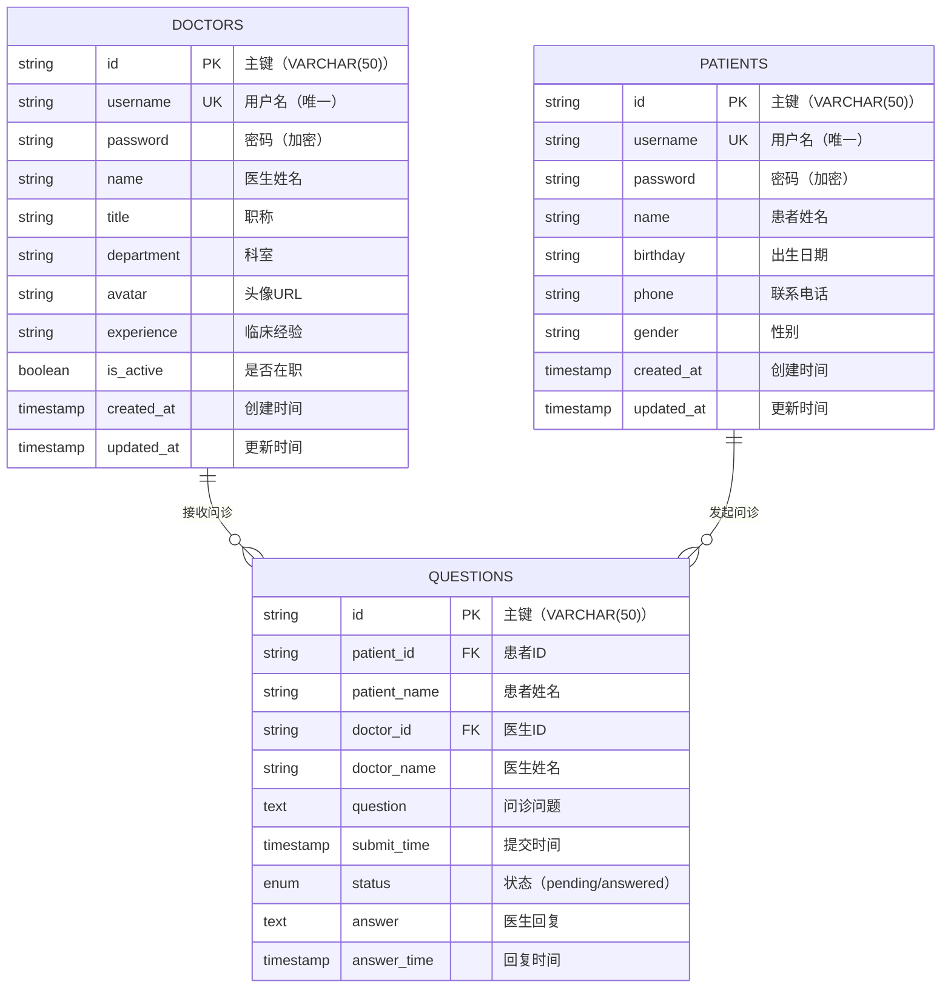
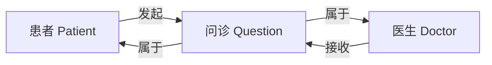
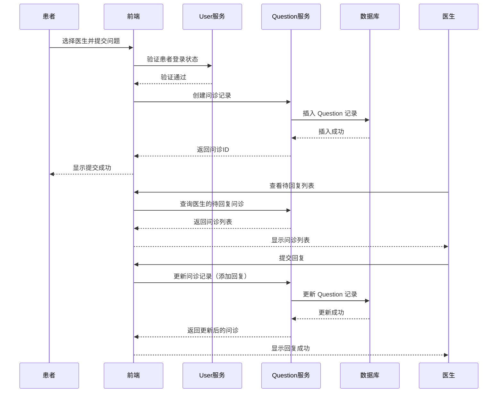
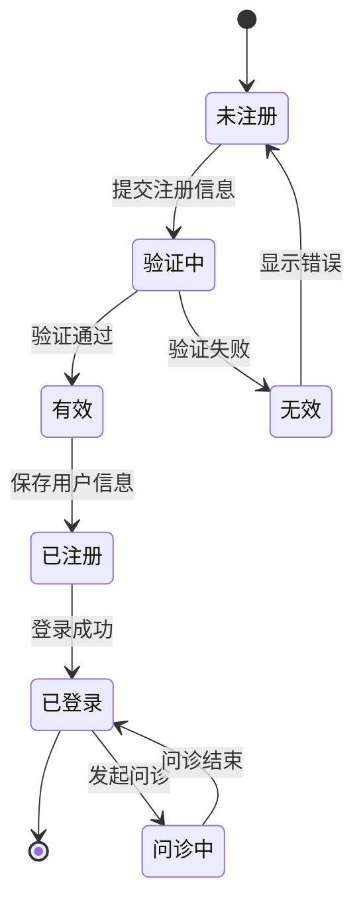

# 数据模型文档

## 概述
本文档描述了 qa-live-healthcare-interview 工作区的数据模型、关系和数据流。它为 AI 模型提供了理解数据结构所需的信息，以便有效地处理代码库。

## 数据库架构

### 概览图



## 实体定义

### Doctor 实体（医生）
**用途**: 表示系统中的医生用户，包含认证信息和专业信息。

**Java 实体类**: `com.leansofx.qaserviceuser.entity.Doctor`

```java
@Entity
@Table(name = "doctors")
public class Doctor {
    @Id
    private String id;
    
    @Column(unique = true, nullable = false)
    private String username;
    
    @JsonIgnore
    @Column(nullable = false)
    private String password;
    
    @Column(nullable = false)
    private String name;
    
    private String title;           // 职称
    private String department;      // 科室
    private String avatar;          // 头像URL
    private String experience;      // 临床经验
    
    @Column(name = "is_active")
    private Boolean isActive = true;
    
    @Column(name = "created_at")
    private LocalDateTime createdAt;
    
    @Column(name = "updated_at")
    private LocalDateTime updatedAt;
    
    @Transient
    private List<String> specialties;  // 专长领域（非持久化）
}
```

**数据库表结构**:
```sql
CREATE TABLE doctors (
    id VARCHAR(50) PRIMARY KEY,
    username VARCHAR(50) NOT NULL UNIQUE,
    password VARCHAR(255) NOT NULL,
    name VARCHAR(100) NOT NULL,
    title VARCHAR(50),
    department VARCHAR(100),
    avatar VARCHAR(500),
    experience VARCHAR(100),
    is_active BOOLEAN DEFAULT TRUE,
    created_at TIMESTAMP DEFAULT CURRENT_TIMESTAMP,
    updated_at TIMESTAMP DEFAULT CURRENT_TIMESTAMP ON UPDATE CURRENT_TIMESTAMP,
    INDEX idx_username (username),
    INDEX idx_is_active (is_active)
) ENGINE=InnoDB DEFAULT CHARSET=utf8mb4 COLLATE=utf8mb4_unicode_ci;
```

### Patient 实体（患者）
**用途**: 表示系统中的患者用户，包含认证信息和基本信息。

**Java 实体类**: `com.leansofx.qaserviceuser.entity.Patient`

```java
@Entity
@Table(name = "patients")
public class Patient {
    @Id
    @Column(length = 50)
    private String id;
    
    @Column(nullable = false, unique = true, length = 50)
    private String username;
    
    @Column(nullable = false, length = 100)
    @JsonIgnore
    private String password;
    
    @Column(nullable = false, length = 50)
    private String name;
    
    @Column(nullable = false)
    private String birthday;    // 出生日期
    
    @Column(length = 20)
    private String phone;       // 联系电话
    
    @Column(length = 10)
    private String gender;      // 性别
    
    @CreationTimestamp
    @Column(name = "created_at", nullable = false, updatable = false)
    private LocalDateTime createdAt;
    
    @UpdateTimestamp
    @Column(name = "updated_at", nullable = false)
    private LocalDateTime updatedAt;
}
```

**数据库表结构**:
```sql
CREATE TABLE patients (
    id VARCHAR(50) PRIMARY KEY,
    username VARCHAR(50) UNIQUE,
    password VARCHAR(255),
    name VARCHAR(100) NOT NULL,
    birthday DATE,
    phone VARCHAR(20),
    gender VARCHAR(10),
    created_at TIMESTAMP DEFAULT CURRENT_TIMESTAMP,
    updated_at TIMESTAMP DEFAULT CURRENT_TIMESTAMP ON UPDATE CURRENT_TIMESTAMP,
    INDEX idx_username (username)
) ENGINE=InnoDB DEFAULT CHARSET=utf8mb4 COLLATE=utf8mb4_unicode_ci;
```

### Question 实体（问诊问题）
**用途**: 表示患者向医生发起的问诊记录，包含问题和回复信息。

**数据库表结构**:
```sql
CREATE TABLE questions (
    id VARCHAR(50) PRIMARY KEY,
    patient_id VARCHAR(50) NOT NULL,
    patient_name VARCHAR(100) NOT NULL,
    doctor_id VARCHAR(50) NOT NULL,
    doctor_name VARCHAR(100) NOT NULL,
    question TEXT NOT NULL,
    submit_time TIMESTAMP DEFAULT CURRENT_TIMESTAMP,
    status ENUM('pending', 'answered') DEFAULT 'pending',
    answer TEXT,
    answer_time TIMESTAMP NULL,
    FOREIGN KEY (doctor_id) REFERENCES doctors(id) ON DELETE CASCADE,
    FOREIGN KEY (patient_id) REFERENCES patients(id) ON DELETE CASCADE,
    INDEX idx_doctor_id (doctor_id),
    INDEX idx_patient_id (patient_id),
    INDEX idx_status (status)
) ENGINE=InnoDB DEFAULT CHARSET=utf8mb4 COLLATE=utf8mb4_unicode_ci;
```

**Java 实体类（待创建）**:
```java
@Entity
@Table(name = "questions")
public class Question {
    @Id
    private String id;
    
    @Column(name = "patient_id", nullable = false)
    private String patientId;
    
    @Column(name = "patient_name", nullable = false)
    private String patientName;
    
    @Column(name = "doctor_id", nullable = false)
    private String doctorId;
    
    @Column(name = "doctor_name", nullable = false)
    private String doctorName;
    
    @Column(nullable = false)
    private String question;
    
    @Column(name = "submit_time")
    private LocalDateTime submitTime;
    
    @Enumerated(EnumType.STRING)
    private QuestionStatus status = QuestionStatus.PENDING;
    
    private String answer;
    
    @Column(name = "answer_time")
    private LocalDateTime answerTime;
    
    @ManyToOne
    @JoinColumn(name = "doctor_id", insertable = false, updatable = false)
    private Doctor doctor;
    
    @ManyToOne
    @JoinColumn(name = "patient_id", insertable = false, updatable = false)
    private Patient patient;
}

enum QuestionStatus {
    PENDING,
    ANSWERED
}
```

## 数据关系

### 一对多关系（One-to-Many）
1. **Doctor → Questions**: 一个医生可以接收多个问诊
2. **Patient → Questions**: 一个患者可以发起多个问诊

### 数据库外键约束
- `questions.doctor_id` → `doctors.id` (ON DELETE CASCADE)
- `questions.patient_id` → `patients.id` (ON DELETE CASCADE)

### 关系图


## 数据流图

### 问诊流程


### 用户注册登录流程


## 数据验证规则

### 医生数据验证
```typescript
const doctorValidationRules = {
  username: {
    required: true,
    minLength: 3,
    maxLength: 50,
    pattern: /^[a-zA-Z0-9_-]+$/,
    unique: true
  },
  password: {
    required: true,
    minLength: 6,
    maxLength: 100
  },
  name: {
    required: true,
    minLength: 2,
    maxLength: 100
  },
  title: {
    required: false,
    maxLength: 50
  },
  department: {
    required: false,
    maxLength: 100
  }
};
```

### 患者数据验证
```typescript
const patientValidationRules = {
  username: {
    required: true,
    minLength: 3,
    maxLength: 50,
    pattern: /^[a-zA-Z0-9_-]+$/,
    unique: true
  },
  password: {
    required: true,
    minLength: 6,
    maxLength: 100
  },
  name: {
    required: true,
    minLength: 2,
    maxLength: 100
  },
  birthday: {
    required: true,
    pattern: /^\d{4}-\d{2}-\d{2}$/
  },
  phone: {
    required: false,
    pattern: /^1[3-9]\d{9}$/
  },
  gender: {
    required: false,
    enum: ['男', '女', '其他']
  }
};
```

### 问诊数据验证
```typescript
const questionValidationRules = {
  patientId: {
    required: true
  },
  doctorId: {
    required: true
  },
  question: {
    required: true,
    minLength: 10,
    maxLength: 2000
  },
  answer: {
    required: false,
    maxLength: 5000
  }
};
```

## 示例数据

### 医生示例数据
```json
{
  "id": "doc001",
  "username": "dr-zhang-wei",
  "password": "$2a$10$...",
  "name": "张伟医生",
  "title": "主任医师",
  "department": "心内科",
  "avatar": "https://images.pexels.com/photos/5215024/pexels-photo-5215024.jpeg",
  "experience": "15年临床经验",
  "isActive": true,
  "createdAt": "2025-01-15T10:30:00",
  "updatedAt": "2025-01-15T10:30:00",
  "specialties": ["高血压", "冠心病", "心律失常"]
}
```

### 患者示例数据
```json
{
  "id": "patient001",
  "username": "zhaoming1985",
  "password": "$2a$10$...",
  "name": "赵明",
  "birthday": "1985-03-15",
  "phone": "13812341234",
  "gender": "男",
  "createdAt": "2025-02-20T14:00:00",
  "updatedAt": "2025-02-20T14:00:00"
}
```

### 问诊示例数据
```json
{
  "id": "qst001",
  "patientId": "patient001",
  "patientName": "赵明",
  "doctorId": "doc001",
  "doctorName": "张伟医生",
  "question": "医生您好，我最近经常感到胸闷，尤其是在运动后。我有高血压家族史，今年35岁，身高175cm，体重85kg。请问我可能是什么问题？需要做哪些检查？",
  "submitTime": "2025-03-10T09:30:00",
  "status": "answered",
  "answer": "您好！根据您的描述，运动后胸闷可能与多种原因有关。考虑到您有高血压家族史，建议您：1. 尽快做一次心电图和心脏彩超；2. 监测血压变化；3. 如胸闷加重或伴有出汗、放射性疼痛，请立即就医。建议您本周内到心内科门诊进一步检查。",
  "answerTime": "2025-03-10T15:20:00"
}
```

## 数据访问模式

### Repository 接口
```java
// 医生数据访问接口
public interface DoctorRepository extends JpaRepository<Doctor, String> {
    Optional<Doctor> findByUsername(String username);
    List<Doctor> findByIsActiveTrue();
    List<Doctor> findByDepartment(String department);
    boolean existsByUsername(String username);
}

// 患者数据访问接口
public interface PatientRepository extends JpaRepository<Patient, String> {
    Optional<Patient> findByUsername(String username);
    boolean existsByUsername(String username);
}

// 问诊数据访问接口（待实现）
public interface QuestionRepository extends JpaRepository<Question, String> {
    List<Question> findByDoctorIdAndStatus(String doctorId, QuestionStatus status);
    List<Question> findByPatientIdOrderBySubmitTimeDesc(String patientId);
    List<Question> findByDoctorIdOrderBySubmitTimeDesc(String doctorId);
}
```

### 查询优化
```sql
-- 为常见查询创建索引
CREATE INDEX idx_doctors_department ON doctors(department);
CREATE INDEX idx_doctors_is_active ON doctors(is_active);
CREATE INDEX idx_patients_username ON patients(username);
CREATE INDEX idx_questions_doctor_status ON questions(doctor_id, status);
CREATE INDEX idx_questions_patient ON questions(patient_id);
CREATE INDEX idx_questions_submit_time ON questions(submit_time DESC);
```

### 常用查询示例
```java
// 查询某科室的在职医生
List<Doctor> activeDoctors = doctorRepository.findByDepartmentAndIsActiveTrue("心内科");

// 查询医生的待回复问诊
List<Question> pendingQuestions = questionRepository
    .findByDoctorIdAndStatus("doc001", QuestionStatus.PENDING);

// 查询患者的问诊历史
List<Question> patientQuestions = questionRepository
    .findByPatientIdOrderBySubmitTimeDesc("patient001");
```

## 数据迁移策略

### 版本 1.0 到 1.1（添加专长表）
```sql
-- 创建医生专长表（将 specialties 从 transient 字段持久化）
CREATE TABLE doctor_specialties (
    id INT AUTO_INCREMENT PRIMARY KEY,
    doctor_id VARCHAR(50) NOT NULL,
    specialty VARCHAR(100) NOT NULL,
    display_order INT DEFAULT 0,
    created_at TIMESTAMP DEFAULT CURRENT_TIMESTAMP,
    UNIQUE KEY uk_doctor_specialty (doctor_id, specialty),
    FOREIGN KEY (doctor_id) REFERENCES doctors(id) ON DELETE CASCADE,
    INDEX idx_doctor_id (doctor_id)
) ENGINE=InnoDB DEFAULT CHARSET=utf8mb4 COLLATE=utf8mb4_unicode_ci;

-- 迁移现有数据（从 JSON 文件）
INSERT INTO doctor_specialties (doctor_id, specialty, display_order) VALUES
('doc001', '高血压', 1),
('doc001', '冠心病', 2),
('doc001', '心律失常', 3),
('doc002', '儿童感冒', 1),
('doc002', '儿童发育', 2),
('doc002', '疫苗接种', 3);
```

### 版本 1.1 到 1.2（添加问诊附件表）
```sql
-- 创建问诊附件表
CREATE TABLE question_attachments (
    id VARCHAR(50) PRIMARY KEY,
    question_id VARCHAR(50) NOT NULL,
    file_name VARCHAR(255) NOT NULL,
    file_url VARCHAR(500) NOT NULL,
    file_type VARCHAR(50),
    file_size INT,
    upload_time TIMESTAMP DEFAULT CURRENT_TIMESTAMP,
    FOREIGN KEY (question_id) REFERENCES questions(id) ON DELETE CASCADE,
    INDEX idx_question_id (question_id)
) ENGINE=InnoDB DEFAULT CHARSET=utf8mb4 COLLATE=utf8mb4_unicode_ci;
```

## 数据安全性

### 密码加密
- **算法**: BCrypt（Spring Security 默认）
- **强度**: 10 轮盐值加密
- **存储**: 密码字段使用 `@JsonIgnore` 注解，避免序列化到前端

```java
// 密码加密示例
@Autowired
private PasswordEncoder passwordEncoder;

public Doctor registerDoctor(Doctor doctor) {
    doctor.setPassword(passwordEncoder.encode(doctor.getPassword()));
    return doctorRepository.save(doctor);
}
```

### 敏感数据保护
- **患者电话**: 前端显示时脱敏处理（如：`138****1234`）
- **患者生日**: 仅用于存储，不展示完整信息
- **医生信息**: 公开显示姓名、职称、科室，不公开用户名和密码

### 访问控制
- **患者**: 只能查看自己的问诊记录
- **医生**: 只能查看和回复自己的问诊
- **未认证用户**: 可以查看医生列表，但不能发起问诊

### 数据保留策略
- **用户数据**: 账号注销后保留 30 天，之后匿名化处理
- **问诊数据**: 保留 3 年，用于医疗质量分析
- **日志数据**: 保留 6 个月

## 数据库配置

### 开发环境（H2）
```properties
spring.datasource.url=jdbc:h2:mem:qahealthcare
spring.datasource.driver-class-name=org.h2.Driver
spring.datasource.username=sa
spring.datasource.password=
spring.jpa.database-platform=org.hibernate.dialect.H2Dialect
spring.jpa.hibernate.ddl-auto=create-drop
spring.h2.console.enabled=true
spring.h2.console.path=/h2-console
```

### 生产环境（MySQL）
```properties
spring.datasource.url=jdbc:mysql://localhost:3306/qa_healthcare?useSSL=false&serverTimezone=Asia/Shanghai&allowPublicKeyRetrieval=true
spring.datasource.username=qa_user
spring.datasource.password=qa_password
spring.datasource.driver-class-name=com.mysql.cj.jdbc.Driver
spring.jpa.database-platform=org.hibernate.dialect.MySQL8Dialect
spring.jpa.hibernate.ddl-auto=validate
```

## 相关源码文件

| 文件 | 路径 | 说明 |
|------|------|------|
| Doctor.java | `server/qa-service-user/src/main/java/com/leansofx/qaserviceuser/entity/Doctor.java` | 医生实体类 |
| Patient.java | `server/qa-service-user/src/main/java/com/leansofx/qaserviceuser/entity/Patient.java` | 患者实体类 |
| DoctorRepository.java | `server/qa-service-user/src/main/java/com/leansofx/qaserviceuser/repository/DoctorRepository.java` | 医生数据访问接口 |
| PatientRepository.java | `server/qa-service-user/src/main/java/com/leansofx/qaserviceuser/repository/PatientRepository.java` | 患者数据访问接口 |
| DoctorService.java | `server/qa-service-user/src/main/java/com/leansofx/qaserviceuser/service/DoctorService.java` | 医生业务逻辑 |
| PatientService.java | `server/qa-service-user/src/main/java/com/leansofx/qaserviceuser/service/PatientService.java` | 患者业务逻辑 |
| init-db.sql | `docker/init-db.sql` | 数据库初始化脚本 |
| doctor-user-list.json | `web/qa-web/src/data/doctor-user-list.json` | 医生模拟数据 |
| patient-user.json | `web/qa-web/src/data/patient-user.json` | 患者模拟数据 |

---

*此数据模型文档应在数据库架构或数据结构发生变化时更新。使用 `/asdm-context-update` 命令保持本文档的最新状态。*
