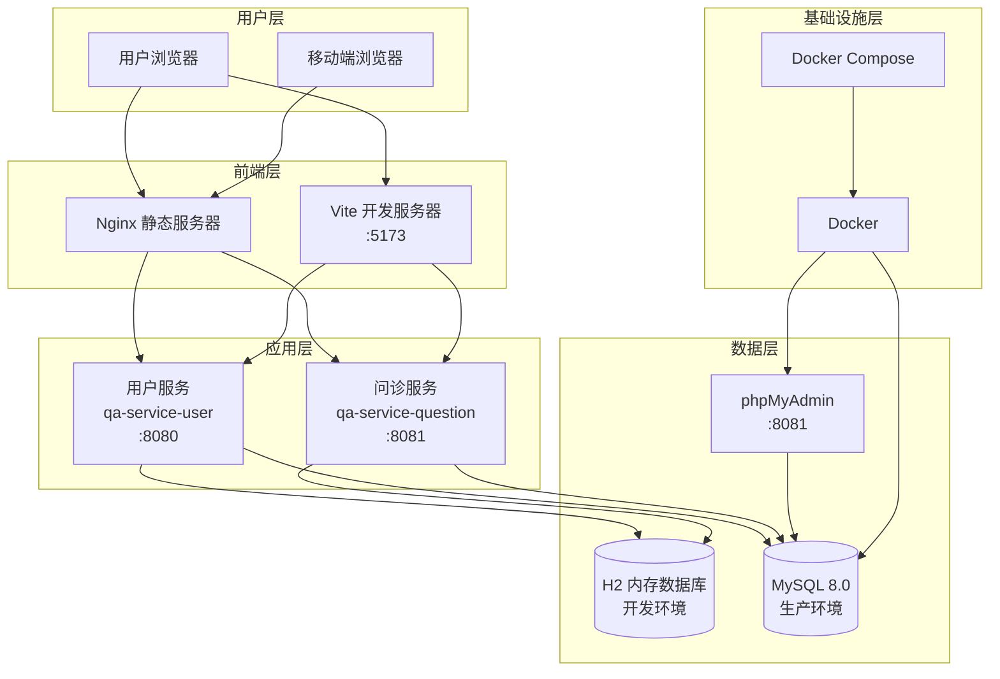
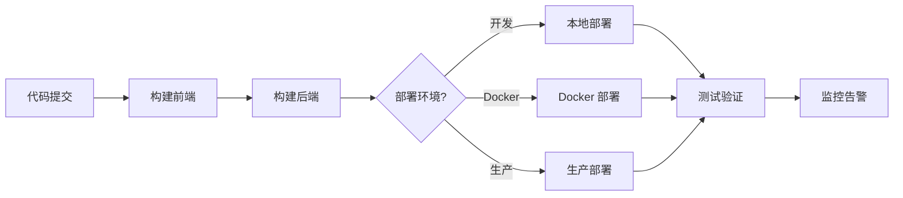

# 部署配置文档

## 概述
本文档描述在线问诊系统的部署架构、配置和流程，为 AI 模型提供部署环境的相关信息。

---

## 部署架构

### 系统架构图



### 组件说明

| 组件 | 用途 | 技术 | 扩展方式 |
|------|------|------|----------|
| **Nginx** | 静态文件服务、反向代理 | Nginx | 水平扩展 |
| **Vite 开发服务器** | 前端开发热重载 | Vite | 单实例 |
| **用户服务** | 患者和医生管理 | Spring Boot | 水平扩展 |
| **问诊服务** | 问诊核心功能（待实现） | Spring Boot | 水平扩展 |
| **H2 数据库** | 开发环境内存数据库 | H2 | 不适用 |
| **MySQL 数据库** | 生产环境关系数据库 | MySQL 8.0 | 垂直/水平扩展 |
| **phpMyAdmin** | 数据库管理工具 | phpMyAdmin | 单实例 |

---

## 环境配置

### 开发环境 (Development)

**配置文件**: `server/qa-service-user/src/main/resources/application.properties`

```properties
# 开发环境配置
spring.application.name=qa-service-user
server.port=8080

# H2 内存数据库（开发环境）
spring.datasource.url=jdbc:h2:mem:qahealthcare
spring.datasource.driver-class-name=org.h2.Driver
spring.datasource.username=sa
spring.datasource.password=

# JPA/Hibernate 配置
spring.jpa.database-platform=org.hibernate.dialect.H2Dialect
spring.jpa.hibernate.ddl-auto=create-drop
spring.jpa.show-sql=true
spring.jpa.properties.hibernate.format_sql=true

# H2 控制台
spring.h2.console.enabled=true
spring.h2.console.path=/h2-console

# 跨域配置
spring.web.cors.allowed-origins=http://localhost:5173
spring.web.cors.allowed-methods=GET,POST,PUT,DELETE,OPTIONS
spring.web.cors.allowed-headers=*
spring.web.cors.max-age=3600

# Actuator 配置
management.endpoints.web.exposure.include=health,info,metrics,env,beans,loggers
management.endpoint.health.show-details=always
management.endpoints.web.base-path=/actuator
```

**前端配置**: `web/qa-web/vite.config.ts`

```typescript
// Vite 开发服务器配置
export default defineConfig({
  plugins: [vue()],
  server: {
    port: 5173,
    host: true,  // 允许外部访问
    proxy: {
      '/api': {
        target: 'http://localhost:8080',
        changeOrigin: true
      }
    }
  }
})
```

### 生产环境 (Production) - 建议配置

**后端配置**: `application-production.properties`（待创建）

```properties
# 生产环境配置
spring.application.name=qa-service-user
server.port=8080

# MySQL 数据源配置
spring.datasource.url=jdbc:mysql://localhost:3306/qa_healthcare?useSSL=true&serverTimezone=Asia/Shanghai&allowPublicKeyRetrieval=true
spring.datasource.username=${DB_USERNAME:qa_user}
spring.datasource.password=${DB_PASSWORD:qa_password}
spring.datasource.driver-class-name=com.mysql.cj.jdbc.Driver

# HikariCP 连接池配置
spring.datasource.hikari.maximum-pool-size=20
spring.datasource.hikari.minimum-idle=5
spring.datasource.hikari.connection-timeout=30000
spring.datasource.hikari.idle-timeout=600000
spring.datasource.hikari.max-lifetime=1800000

# JPA/Hibernate 配置
spring.jpa.database-platform=org.hibernate.dialect.MySQL8Dialect
spring.jpa.hibernate.ddl-auto=validate
spring.jpa.show-sql=false

# 跨域配置
spring.web.cors.allowed-origins=https://www.yourdomain.com
spring.web.cors.allowed-methods=GET,POST,PUT,DELETE,OPTIONS
spring.web.cors.allowed-headers=*
spring.web.cors.allow-credentials=true
spring.web.cors.max-age=3600

# Actuator 配置
management.endpoints.web.exposure.include=health,info,metrics
management.endpoint.health.show-details=when-authorized
management.endpoints.web.base-path=/actuator

# 日志配置
logging.level.com.leansofx=INFO
logging.file.name=logs/qa-service-user.log
logging.pattern.file=%d{yyyy-MM-dd HH:mm:ss} [%thread] %-5level %logger{36} - %msg%n
```

**前端配置**: `.env.production`（待创建）

```properties
# 生产环境 API 地址
VITE_API_BASE_URL=https://api.yourdomain.com
VITE_API_USER_SERVICE=https://api.yourdomain.com/api
VITE_API_QUESTION_SERVICE=https://api.yourdomain.com/api
```

---

## 部署流程

### 部署流程图



---

## 部署步骤

### 1. 开发环境部署

#### 1.1 启动基础设施（可选）

```bash
# 启动 MySQL 和 phpMyAdmin
cd /Users/wangyunli/citicbank/practice/qa-live-healthcare-interview
docker-compose up -d

# 验证容器状态
docker ps

# 查看日志
docker logs qa-healthcare-mysql
docker logs qa-healthcare-phpmyadmin
```

**访问**:
- MySQL: `localhost:3306`
  - 用户名: `qa_user`
  - 密码: `qa_password`
  - 数据库: `qa_healthcare`
- phpMyAdmin: http://localhost:8081
  - 用户名: `qa_user`
  - 密码: `qa_password`

#### 1.2 启动后端服务

```bash
# 启动用户服务 (端口 8080)
cd server/qa-service-user
chmod +x mvnw
./mvnw spring-boot:run

# 另一个终端，启动问诊服务 (端口 8081)
cd server/qa-service-question
chmod +x mvnw
./mvnw spring-boot:run
```

**验证**:
```bash
# 测试用户服务
curl http://localhost:8080/api/test/cors

# 测试 H2 控制台
open http://localhost:8080/h2-console
# JDBC URL: jdbc:h2:mem:qahealthcare
# 用户名: sa
# 密码: (空)
```

#### 1.3 启动前端应用

```bash
# 安装依赖
cd web/qa-web
npm install

# 启动开发服务器 (端口 5173)
npm run dev
```

**访问**: http://localhost:5173

---

### 2. Docker 部署

#### 2.1 创建后端 Dockerfile

**文件**: `server/qa-service-user/Dockerfile`

```dockerfile
# 多阶段构建
FROM maven:3.9-eclipse-temurin-17 AS builder

WORKDIR /app

# 复制 pom.xml 和源代码
COPY pom.xml .
COPY src ./src

# 构建应用
RUN ./mvnw clean package -DskipTests

# 运行阶段
FROM eclipse-temurin:17-jre

WORKDIR /app

# 复制 JAR 文件
COPY --from=builder /app/target/*.jar app.jar

# 创建非 root 用户
RUN addgroup --system appgroup && \
    adduser --system appuser --group appgroup

USER appuser

# 健康检查
HEALTHCHECK --interval=30s --timeout=3s --start-period=10s --retries=3 \
  CMD curl -f http://localhost:8080/actuator/health || exit 1

EXPOSE 8080

ENTRYPOINT ["java", "-jar", "app.jar"]
```

#### 2.2 创建前端 Dockerfile

**文件**: `web/qa-web/Dockerfile`

```dockerfile
# 构建阶段
FROM node:22-alpine AS builder

WORKDIR /app

# 复制依赖文件
COPY package*.json ./

# 安装依赖
RUN npm install

# 复制源代码
COPY . .

# 构建应用
RUN npm run build

# 运行阶段
FROM nginx:alpine

# 复制自定义 Nginx 配置
COPY nginx.conf /etc/nginx/conf.d/default.conf

# 复制构建产物
COPY --from=builder /app/dist /usr/share/nginx/html

# 健康检查
HEALTHCHECK --interval=30s --timeout=3s --start-period=5s --retries=3 \
  CMD wget -qO- http://localhost:80/health || exit 1

EXPOSE 80

CMD ["nginx", "-g", "daemon off;"]
```

#### 2.3 创建 Nginx 配置

**文件**: `web/qa-web/nginx.conf`

```nginx
server {
    listen 80;
    server_name localhost;

    root /usr/share/nginx/html;
    index index.html;

    # 健康检查端点
    location /health {
        access_log off;
        return 200 "healthy\n";
        add_header Content-Type text/plain;
    }

    # 静态文件
    location / {
        try_files $uri $uri/ /index.html;
    }

    # API 反向代理
    location /api/ {
        proxy_pass http://qa-service-user:8080/;
        proxy_set_header Host $host;
        proxy_set_header X-Real-IP $remote_addr;
        proxy_set_header X-Forwarded-For $proxy_add_x_forwarded_for;
        proxy_set_header X-Forwarded-Proto $scheme;
    }

    # 启用 gzip 压缩
    gzip on;
    gzip_types text/plain text/css application/json application/javascript text/xml application/xml application/xml+rss text/javascript;
}
```

#### 2.4 更新 Docker Compose 配置

**文件**: `docker-compose.yml`（扩展版本）

```yaml
version: '3.8'

services:
  mysql:
    image: mysql:8.0
    container_name: qa-healthcare-mysql
    restart: always
    environment:
      MYSQL_ROOT_PASSWORD: root123456
      MYSQL_DATABASE: qa_healthcare
      MYSQL_USER: qa_user
      MYSQL_PASSWORD: qa_password
    ports:
      - "3306:3306"
    volumes:
      - mysql-data:/var/lib/mysql
      - ./docker/init-db.sql:/docker-entrypoint-initdb.d/init-db.sql
    command: --default-authentication-plugin=mysql_native_password
    healthcheck:
      test: ["CMD", "mysqladmin", "ping", "-h", "localhost"]
      timeout: 20s
      retries: 10
    networks:
      - qa-network

  phpmyadmin:
    image: phpmyadmin/phpmyadmin:latest
    container_name: qa-healthcare-phpmyadmin
    restart: always
    depends_on:
      mysql:
        condition: service_healthy
    environment:
      PMA_HOST: mysql
      PMA_PORT: 3306
      PMA_USER: qa_user
      PMA_PASSWORD: qa_password
    ports:
      - "8081:80"
    networks:
      - qa-network

  qa-service-user:
    build:
      context: ./server/qa-service-user
      dockerfile: Dockerfile
    container_name: qa-healthcare-user-service
    restart: always
    depends_on:
      mysql:
        condition: service_healthy
    environment:
      SPRING_PROFILES_ACTIVE: docker
      DB_HOST: mysql
      DB_PORT: 3306
      DB_NAME: qa_healthcare
      DB_USERNAME: qa_user
      DB_PASSWORD: qa_password
    ports:
      - "8080:8080"
    networks:
      - qa-network

  qa-service-question:
    build:
      context: ./server/qa-service-question
      dockerfile: Dockerfile
    container_name: qa-healthcare-question-service
    restart: always
    depends_on:
      mysql:
        condition: service_healthy
    environment:
      SPRING_PROFILES_ACTIVE: docker
      DB_HOST: mysql
      DB_PORT: 3306
      DB_NAME: qa_healthcare
      DB_USERNAME: qa_user
      DB_PASSWORD: qa_password
    ports:
      - "8081:8081"
    networks:
      - qa-network

  frontend:
    build:
      context: ./web/qa-web
      dockerfile: Dockerfile
    container_name: qa-healthcare-frontend
    restart: always
    depends_on:
      - qa-service-user
    ports:
      - "80:80"
    networks:
      - qa-network

networks:
  qa-network:
    driver: bridge

volumes:
  mysql-data:
```

#### 2.5 部署命令

```bash
# 构建并启动所有服务
docker-compose up -d

# 查看服务状态
docker-compose ps

# 查看日志
docker-compose logs -f

# 停止所有服务
docker-compose down

# 重新构建并启动
docker-compose up -d --build
```

---

### 3. 生产环境部署（建议）

#### 3.1 前置要求

- Linux 服务器（推荐 Ubuntu 22.04 LTS）
- Docker 和 Docker Compose 已安装
- 域名和 SSL 证书
- MySQL 数据库（可使用云数据库服务）

#### 3.2 部署步骤

```bash
# 1. 克隆代码
git clone <repository-url>
cd qa-live-healthcare-interview

# 2. 创建生产环境配置文件
cp server/qa-service-user/src/main/resources/application.properties \
   server/qa-service-user/src/main/resources/application-production.properties

# 3. 编辑生产环境配置
# 修改数据库地址、用户名、密码等

# 4. 构建前端应用
cd web/qa-web
npm install
npm run build

# 5. 构建后端应用
cd ../../server/qa-service-user
./mvnw clean package -DskipTests

cd ../qa-service-question
./mvnw clean package -DskipTests

# 6. 使用 Docker Compose 部署
cd ../..
docker-compose -f docker-compose.production.yml up -d

# 7. 配置 Nginx 反向代理（如果使用独立 Nginx）
# 参考配置如下
```

#### 3.3 Nginx 反向代理配置

**文件**: `/etc/nginx/sites-available/qa-healthcare`

```nginx
# HTTP 配置（重定向到 HTTPS）
server {
    listen 80;
    server_name yourdomain.com www.yourdomain.com;
    
    location / {
        return 301 https://$host$request_uri;
    }
}

# HTTPS 配置
server {
    listen 443 ssl http2;
    server_name yourdomain.com www.yourdomain.com;
    
    # SSL 证书配置
    ssl_certificate /path/to/fullchain.pem;
    ssl_certificate_key /path/to/privkey.pem;
    ssl_protocols TLSv1.2 TLSv1.3;
    ssl_ciphers HIGH:!aNULL:!MD5;
    
    # 前端静态文件
    location / {
        root /var/www/qa-healthcare;
        try_files $uri $uri/ /index.html;
    }
    
    # 用户服务 API
    location /api/auth/ {
        proxy_pass http://localhost:8080;
        proxy_set_header Host $host;
        proxy_set_header X-Real-IP $remote_addr;
        proxy_set_header X-Forwarded-For $proxy_add_x_forwarded_for;
        proxy_set_header X-Forwarded-Proto $scheme;
    }
    
    # 医生服务 API
    location /api/doctors/ {
        proxy_pass http://localhost:8080;
        proxy_set_header Host $host;
        proxy_set_header X-Real-IP $remote_addr;
        proxy_set_header X-Forwarded-For $proxy_add_x_forwarded_for;
        proxy_set_header X-Forwarded-Proto $scheme;
    }
    
    # 问诊服务 API（待实现）
    location /api/questions/ {
        proxy_pass http://localhost:8081;
        proxy_set_header Host $host;
        proxy_set_header X-Real-IP $remote_addr;
        proxy_set_header X-Forwarded-For $proxy_add_x_forwarded_for;
        proxy_set_header X-Forwarded-Proto $scheme;
    }
    
    # 健康检查
    location /health {
        access_log off;
        return 200 "healthy\n";
        add_header Content-Type text/plain;
    }
}
```

#### 3.4 SSL 证书配置（Let's Encrypt）

```bash
# 安装 Certbot
sudo apt update
sudo apt install certbot python3-certbot-nginx

# 获取 SSL 证书
sudo certbot --nginx -d yourdomain.com -d www.yourdomain.com

# 自动续期
sudo certbot renew --dry-run
```

---

## 部署检查清单

### 部署前检查

- [ ] 代码已通过所有测试
- [ ] 代码审查已完成
- [ ] 安全扫描已通过
- [ ] 数据库迁移脚本已测试
- [ ] 回滚计划已准备
- [ ] 配置文件已更新（数据库地址、密码等）
- [ ] 环境变量已设置
- [ ] SSL 证书已配置（生产环境）

### 部署中检查

- [ ] 先部署到测试环境
- [ ] 运行冒烟测试
- [ ] 监控指标正常
- [ ] 功能验证通过
- [ ] 文档已更新

### 部署后检查

- [ ] 错误率监控正常
- [ ] 性能指标正常
- [ ] 备份已完成
- [ ] 部署日志已更新
- [ ] 相关方已通知

---

## 监控和可观测性

### 健康检查端点

| 端点 | 说明 | 期望响应 |
|------|------|----------|
| `/actuator/health` | 应用健康状态 | `{"status":"UP"}` |
| `/actuator/info` | 应用信息 | 应用版本、环境等 |
| `/actuator/metrics` | 应用指标 | JVM、HTTP 请求等指标 |

### 日志管理

**后端日志配置**:

```properties
# application-production.properties
logging.level.com.leansofx=INFO
logging.file.name=/var/log/qa-service-user/app.log
logging.pattern.file=%d{yyyy-MM-dd HH:mm:ss} [%thread] %-5level %logger{36} - %msg%n
logging.logback.rollingpolicy.max-history=30
logging.logback.rollingpolicy.max-file-size=10MB
```

**查看日志**:

```bash
# Docker 部署
docker logs -f qa-healthcare-user-service

# 生产环境
tail -f /var/log/qa-service-user/app.log
```

### 性能监控（建议）

**集成 Prometheus + Grafana**:

1. 添加 Micrometer 依赖
2. 配置 Prometheus 端点
3. 设置 Grafana 仪表盘
4. 配置告警规则

---

## 备份和灾难恢复

### 数据库备份策略

```bash
#!/bin/bash
# scripts/backup.sh

# 配置
DB_HOST="localhost"
DB_PORT="3306"
DB_USER="qa_user"
DB_PASSWORD="qa_password"
DB_NAME="qa_healthcare"
BACKUP_DIR="/backup/mysql"
DATE=$(date +%Y%m%d_%H%M%S)

# 创建备份目录
mkdir -p $BACKUP_DIR

# 备份数据库
mysqldump -h $DB_HOST -P $DB_PORT -u $DB_USER -p$DB_PASSWORD \
  --single-transaction --routines --triggers \
  $DB_NAME > $BACKUP_DIR/backup_$DATE.sql

# 压缩备份文件
gzip $BACKUP_DIR/backup_$DATE.sql

# 删除 30 天前的备份
find $BACKUP_DIR -name "backup_*.sql.gz" -mtime +30 -delete

echo "Backup completed: backup_$DATE.sql.gz"
```

### 恢复流程

```bash
#!/bin/bash
# scripts/restore.sh

# 配置
DB_HOST="localhost"
DB_PORT="3306"
DB_USER="qa_user"
DB_PASSWORD="qa_password"
DB_NAME="qa_healthcare"
BACKUP_FILE=$1

if [ -z "$BACKUP_FILE" ]; then
    echo "Usage: $0 <backup_file>"
    exit 1
fi

# 停止应用
docker-compose stop qa-service-user qa-service-question

# 恢复数据库
gunzip -c $BACKUP_FILE | mysql -h $DB_HOST -P $DB_PORT -u $DB_USER -p$DB_PASSWORD $DB_NAME

# 重启应用
docker-compose start qa-service-user qa-service-question

# 验证恢复
curl http://localhost:8080/actuator/health

echo "Restore completed from: $BACKUP_FILE"
```

---

## 故障排查

### 常见问题

#### 1. 数据库连接问题

```bash
# 检查数据库连通性
nc -zv localhost 3306

# 检查数据库状态
docker exec -it qa-healthcare-mysql mysql -u qa_user -p -e "SHOW DATABASES;"

# 检查连接池
# 查看应用日志中的连接池状态
```

#### 2. 应用崩溃

```bash
# 查看日志
docker logs -f qa-healthcare-user-service

# 检查资源使用
docker stats

# 检查事件
docker events

# 调试容器
docker exec -it qa-healthcare-user-service /bin/sh
```

#### 3. 性能问题

```bash
# 查看慢查询
docker exec -it qa-healthcare-mysql mysql -u root -p -e "
SELECT * FROM information_schema.PROCESSLIST WHERE COMMAND != 'Sleep' AND TIME > 5;
"

# 查看应用指标
curl http://localhost:8080/actuator/metrics/jvm.memory.used

# 查看 GC 日志
# 在应用启动时添加 JVM 参数
# -Xlog:gc*:file=/var/log/gc.log:time,uptime,level,tags
```

---

## 部署架构演进

### 当前架构

```
┌─────────────────┐
│   用户浏览器     │
└────────┬────────┘
         │
┌────────┴────────┐
│   Nginx (80)    │
└────────┬────────┘
         │
    ┌────┴────┐
    │         │
┌───┴───┐ ┌──┴────┐
│ 前端   │ │ 后端   │
│(静态)  │ │(:8080) │
└────────┘ └───┬────┘
               │
         ┌─────┴─────┐
         │   MySQL   │
         │  (:3306)  │
         └───────────┘
```

### 推荐的生产架构

```
                ┌─────────────────┐
                │   Nginx (80/443) │
                │   (负载均衡)      │
                └────────┬────────┘
                         │
         ┌───────────────┼───────────────┐
         │               │               │
    ┌────┴────┐    ┌────┴────┐    ┌────┴────┐
    │ 前端 1   │    │ 前端 2   │    │ 前端 3   │
    │(静态文件)│    │(静态文件)│    │(静态文件)│
    └─────────┘    └─────────┘    └─────────┘
                         │
         ┌───────────────┼───────────────┐
         │               │               │
    ┌────┴────┐    ┌────┴────┐    ┌────┴────┐
    │用户服务 1│    │用户服务 2│    │用户服务 3│
    │ (:8080) │    │ (:8080) │    │ (:8080) │
    └─────────┘    └─────────┘    └─────────┘
                         │
         ┌───────────────┼───────────────┐
         │               │               │
    ┌────┴────┐    ┌────┴────┐    ┌────┴────┐
    │ MySQL   │    │ MySQL   │    │ MySQL   │
    │ (主库)  │◄──►│(从库1) │◄──►│(从库2) │
    └─────────┘    └─────────┘    └─────────┘
```

---

## 相关配置文件

### 后端
- `server/qa-service-user/src/main/resources/application.properties` - 开发环境配置
- `server/qa-service-user/src/main/resources/application-production.properties` - 生产环境配置（待创建）
- `server/qa-service-user/Dockerfile` - 后端 Dockerfile（待创建）

### 前端
- `web/qa-web/vite.config.ts` - Vite 开发配置
- `web/qa-web/Dockerfile` - 前端 Dockerfile（待创建）
- `web/qa-web/nginx.conf` - Nginx 配置（待创建）
- `web/qa-web/.env.production` - 生产环境变量（待创建）

### 基础设施
- `docker-compose.yml` - Docker Compose 配置
- `docker-compose.production.yml` - 生产环境 Docker Compose 配置（待创建）
- `docker/init-db.sql` - 数据库初始化脚本

### Nginx
- `/etc/nginx/sites-available/qa-healthcare` - Nginx 反向代理配置（待创建）

---

*本文档描述系统的部署配置和流程。当部署架构或流程发生变更时，请使用 `/asdm-context-update` 更新此文档。*
